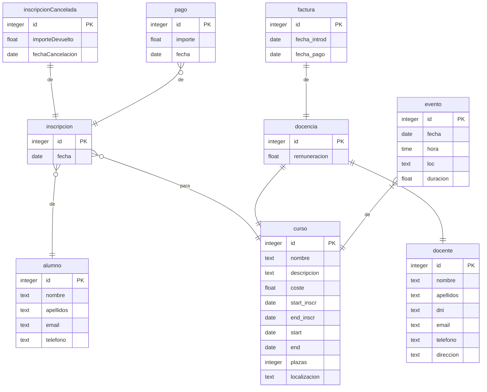
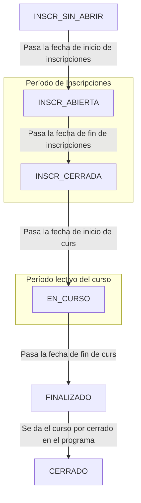
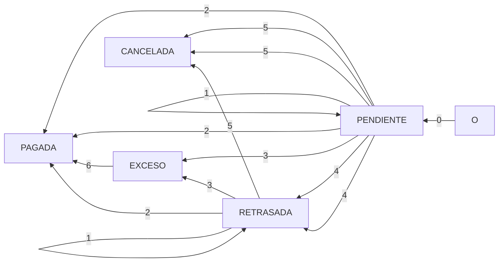

SI2022-PL41
<% tp.file.creation_date() %> (YYYY-MM-DD) @ 09:40
Rodríguez López, Alejandro // UO281827

Tags:
	#showable
	Hecho en #EPI
	Sobre #Sistemas_Informacion 
	Para
	Otros:
	Refs:
		 [REPO](www.github.com/miermontoto/SI2022-PL41)
 

## ER de la BBDD

## DTE de los estados de un Curso

## DTE de los estados de una Inscripción

0. Se crea una inscripción de una persona para un curso
1. Se paga una cantidad, pero aún falta más por pagar
2. Se paga una cantidad, y no queda más por pagar
3. Se paga una cantidad, pero el total pagado excede la cantidad debida
4. El período conveniente para realizar el pago ha pasado y no se ha cumplido el pago aún
5. La inscripción es cancelada
6. Se devuelve la cantidad que excede

