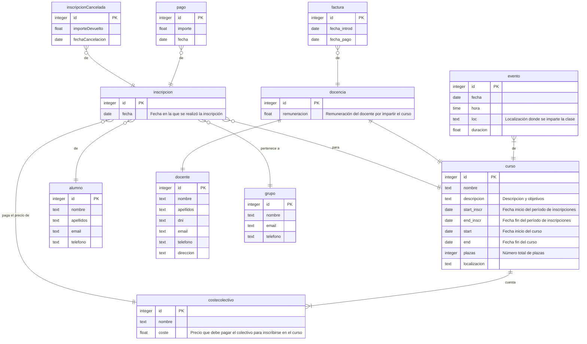

# Documentación SI2022-PL41
Esta documentación se ha generado utilizando Markdown. Esto nos permite escribir documentación de forma más eficiente.
Los ficheros markdown no son renderizados en Teams por el momento, pero sí se muestran adecuadamente en GitHub.

## ER de la BBDD
Los diagramas han sido generados utilizando [Mermaid](https://mermaid.js.org).

Véase leyenda de las cardinalidades tras el diagrama.

Se recomienda utilizar los controles localizados en la parte inferior derecha para navegar por el diagrama.

Leyenda:

## DTE de los estados de un Curso

## DTE de los estados de una Inscripción

0. Se crea una inscripción de una persona para un curso
1. Se paga una cantidad, pero aún falta más por pagar
2. Se paga una cantidad, y no queda más por pagar
3. Se paga una cantidad, pero el total pagado excede la cantidad debida
4. El período conveniente para realizar el pago ha pasado y no se ha cumplido el pago aún
5. La inscripción es cancelada
6. Se devuelve la cantidad que excede

